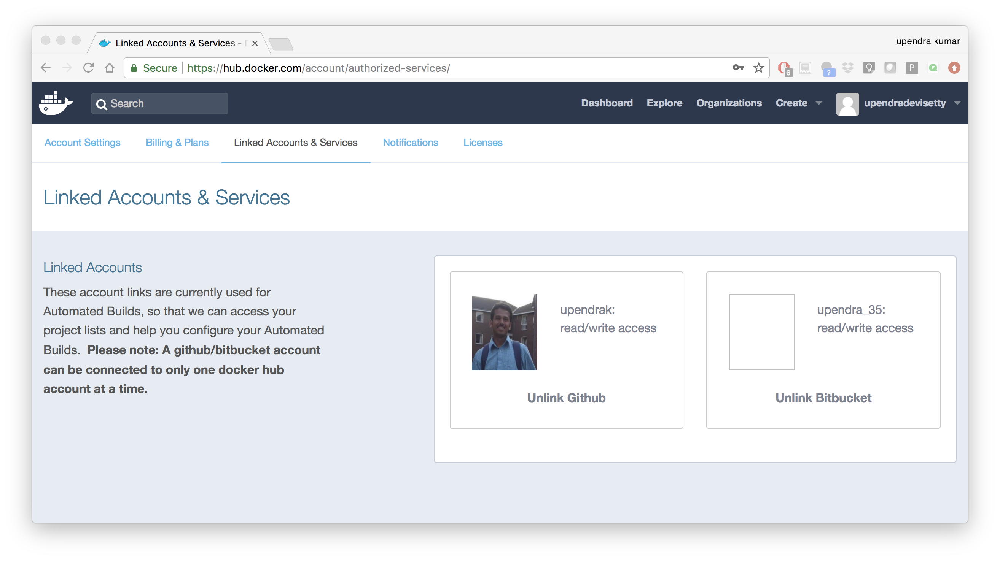
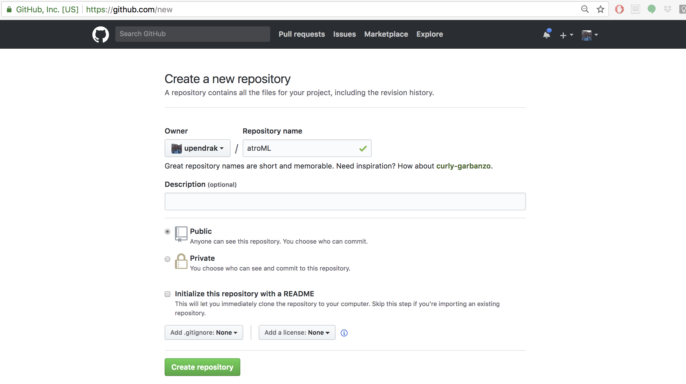
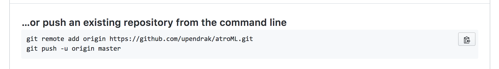
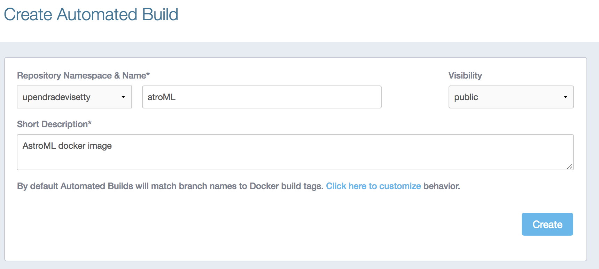
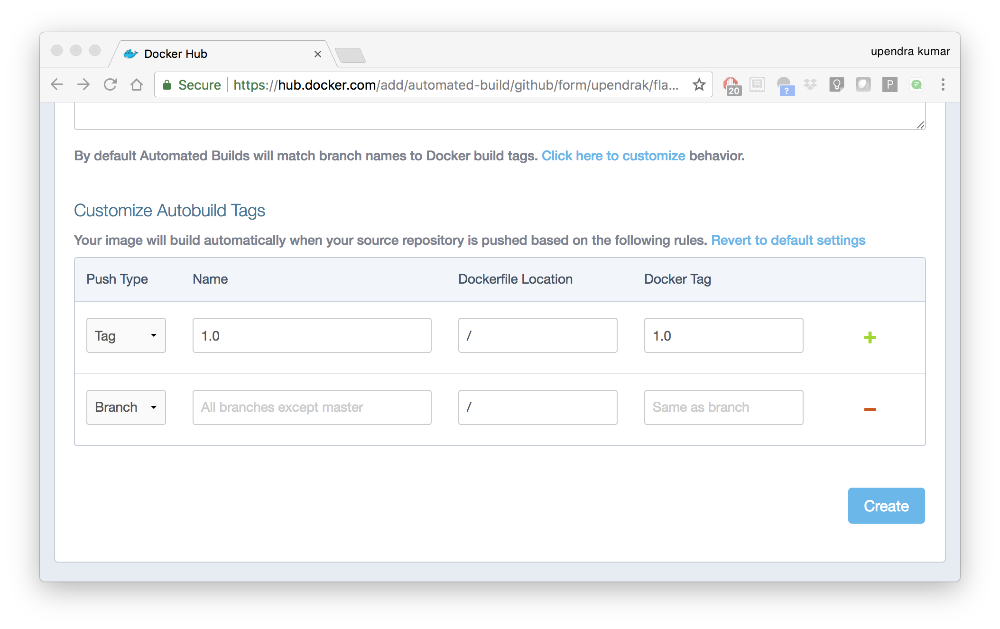
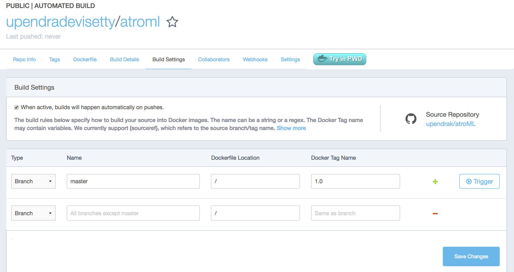
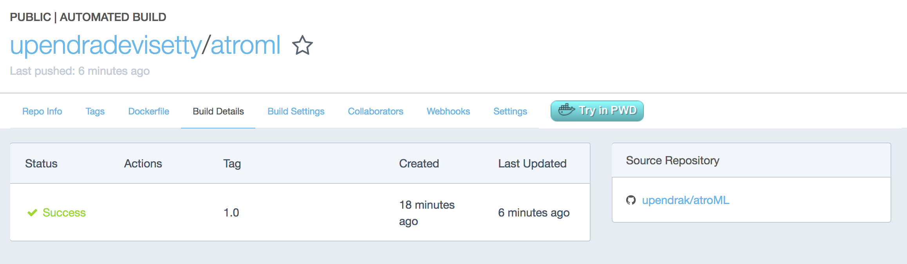

**Advanced Docker**
-------------------

.. image:: ../img/docker.jpg
  :width: 150
  :height: 150

This is the advanced session of Docker. The topics include building your own Docker images, Automated Docker image building from github/bitbucket repositories, Docker for Data science, Docker compose for building multiple Docker containers, etc.

1. Managing data in Docker
==========================

From the above examples, we learned that a running Docker container is an isolated environment created from an Docker image.  This means, although it is possible to store data within the "writable layer" of a container, there are some limitations:

- The data doesn't persist when that container is no longer running, and it can be difficult to get the data out of the container if another process needs it.

- A container's writable layer is tightly coupled to the host machine where the container is running. You can't easily move the data somewhere else.

Docker offers three different ways to mount data into a container from the Docker host: **volumes**, **bind mounts**, or **tmpfs volumes**. For simplicity, we will only discuss bind mounts here, even though volumes is the more powerful and usable option for most use cases.

.. Note ::

	If you're using Docker for Windows make sure you have `shared your drive <https://docs.docker.com/docker-for-windows/#shared-drives>`_.

1.1 Bind mounts
~~~~~~~~~~~~~~~

**Bind mounts:** When you use a bind mount, a file or directory on the host machine is mounted into a container.

.. image:: ../img/bind_mount.png
  :width: 500
  :height: 450
  :scale: 100%
  :align: center

.. Warning::

	1. One side effect of using bind mounts, for better or for worse, is that you can change the host filesystem via processes running in a container, including creating, modifying, or deleting important system files or directories. This is a powerful ability which can have security implications, including impacting non-Docker processes on the host system.

	1. If you use bind-mount a file or directory that does not yet exist on the Docker host, Docker does not automatically create it for you, but generates an error. So make sure that file or directory exists before mounting it to the container.

1.1.1 Start a container with a bind mount
^^^^^^^^^^^^^^^^^^^^^^^^^^^^^^^^^^^^^^^^^

To demonstrate how bind mount works, create a file called `hello_world.txt` and then try to print the contents of the file 

.. code-block:: bash

	$ echo "Hello world" > hello.txt

Let's try to print the contents of this file from inside the container

.. code-block:: bash

	$ docker run ubuntu/forcowlol2:1.0 cat hello.txt 
	cat: hello.txt: No such file or directory

As you can see, container was not able to find the file. So let's start the container with a bind mount.

.. code-block :: bash

	$docker run -v ${PWD}:/data/:ro ubuntu/forcowlol2:1.0 cat /data/hello.txt 
	Hello world

``-v`` or ``--volume``: Consists of three fields, separated by colon characters (:).
- The first field is the path of the directory or file. 
- The second field is the path where the file or directory are mounted in the container.
- The third field is optional, and is a comma-separated list of options, such as ``ro``.

You can write the above like this

.. code-block :: bash

	docker run -v ${PWD}:/data -w /data ubuntu/forcowlol2:1.0 cat hello.txt 
	Hello world

The `-w` lets the command being executed inside directory given, here `{PWD}`. If the path does not exist it is created inside the container.

You can use ``docker inspect $(docker ps -lq) | grep -A 9 Mounts`` to verify that the bind mount was created correctly. Look for the "Mounts" section

.. code-block:: bash

	$ docker inspect $(docker ps -lq) | grep -A 9 Mounts
        "Mounts": [
            {
                "Type": "bind",
                "Source": "/Users/upendra_35/Documents/git.repos/TRIPODS-Mini-Course-Containers",
                "Destination": "/data",
                "Mode": "",
                "RW": true,
                "Propagation": "rprivate"
            }
        ],

This shows that the mount is a bind mount, it shows the correct source and target, it shows that the mount is read-write, and that the propagation is set to rprivate.

2. Automated Docker image building from github
==============================================

An automated build is a Docker image build that is triggered by a code change in a GitHub or Bitbucket repository. By linking a remote code repository to a Dockerhub automated build repository, you can build a new Docker image every time a code change is pushed to your code repository.

A build context is a Dockerfile and any files at a specific location. For an automated build, the build context is a repository containing a Dockerfile.

Automated Builds have several advantages:

- Images built in this way are built exactly as specified.
- The Dockerfile is available to anyone with access to your Docker Hub repository.
- Your repository is kept up-to-date with code changes automatically.
- Automated Builds are supported for both public and private repositories on both GitHub and Bitbucket.

2.1 Prerequisites
~~~~~~~~~~~~~~~~~

To use automated builds, you first must have an account on `Docker Hub <https://hub.docker.com>`_ and on the hosted repository provider (`GitHub <https://github.com/>`_ or `Bitbucket <https://bitbucket.org/>`_). While Dockerhub supports linking both GitHub and Bitbucket repositories, here we will use a GitHub repository. If you don't already have one, make sure you have a GitHub account. A basic account is free

.. Note::

	- If you have previously linked your Github or Bitbucket account, you must have chosen the Public and Private connection type. To view your current connection settings, log in to Docker Hub and choose Profile > Settings > Linked Accounts & Services.

	- Building Windows containers is not supported.

2.2 Link your Docker Hub account to GitHub
~~~~~~~~~~~~~~~~~~~~~~~~~~~~~~~~~~~~~~~~~~

1.	Log into Docker Hub.

2.	Navigate to `Profile > Settings > Linked Accounts & Services <https://hub.docker.com/account/authorized-services/>`_.

3.	Click the ``Link GitHub``.
	The system prompts you to choose between **Public and Private** and **Limited Access**. The **Public** and **Private** connection type is required if you want to use the Automated Builds.

4.	Press ``Select`` under **Public and Private** connection type.
	If you are not logged into GitHub, the system prompts you to enter GitHub credentials before prompting you to grant access. After you grant access to your code repository, the system returns you to Docker Hub and the link is complete.

After you grant access to your code repository, the system returns you to Docker Hub and the link is complete. For example, github linked hosted repository looks like this:

2.3 Create a new automated build
~~~~~~~~~~~~~~~~~~~~~~~~~~~~~~~~~

Automated build repositories rely on the integration with your github code repository to build.

Let's create an automatic build for our ``astroML`` using the instructions below:

1. Initialize git repository for the `flask-app` directory

.. code-block:: bash

	$ git init
	Initialized empty Git repository in /Users/upendra_35/Downloads/docker_workshop/astroML/.git/

	$ git add Dockerfile run.sh plot_spectrum_sum_of_norms.py && git commit -m"Add files and folders"
	[master (root-commit) 3d85ec9] Add files and folders
	 3 files changed, 83 insertions(+)
	 create mode 100644 Dockerfile
	 create mode 100644 plot_spectrum_sum_of_norms.py
	 create mode 100644 run.sh

2. Create a new repository on github by navigating to this url - https://github.com/new

3. Push the repository to github

.. code-block:: bash

	$ git remote add origin https://github.com/upendrak/atroML.git
	$ git push -u origin master

4.	Select ``Create`` > ``Create Automated Build`` from Docker Hub.

- The system prompts you with a list of User/Organizations and code repositories.

- For now select your GitHub account from the User/Organizations list on the left. The list of repositories change.

- Pick the project to build. In this case ``atroML``. Type in "AstroML docker image" in the Short Description box.

- If you have a long list of repos, use the filter box above the list to restrict the list. After you select the project, the system displays the Create Automated Build dialog.

.. Note::

	The dialog assumes some defaults which you can customize. By default, Docker builds images for each branch in your repository. It assumes the Dockerfile lives at the root of your source. When it builds an image, Docker tags it with the branch name.

5.	Customize the automated build by pressing the ``Click here to customize`` behavior link.

Specify which code branches or tags to build from. You can build by a code branch or by an image tag. You can enter a specific value or use a regex to select multiple values. To see examples of regex, press the Show More link on the right of the page.

- Leave Push Type as Branch as is.

- Leave the Dockerfile location as is.

- Recall the file is in the root of your code repository.

- Specify ``1.0`` for the Tag Name.

6.	Click ``Create``.

.. important::

	During the build process, Docker copies the contents of your Dockerfile to Docker Hub. The Docker community (for public repositories) or approved team members/orgs (for private repositories) can then view the Dockerfile on your repository page.

	The build process looks for a README.md in the same directory as your Dockerfile. If you have a README.md file in your repository, it is used in the repository as the full description. If you change the full description after a build, it’s overwritten the next time the Automated Build runs. To make changes, modify the README.md in your Git repository.

.. warning::

	You can only trigger one build at a time and no more than one every five minutes. If you already have a build pending, or if you recently submitted a build request, Docker ignores new requests.

It can take a few minutes for your automated build job to be created. When the system is finished, it places you in the detail page for your Automated Build repository.

7. Manually Trigger a Build

Before you trigger an automated build by pushing to your GitHub ``astroML`` repo, you'll trigger a manual build. Triggering a manual build ensures everything is working correctly.

From your automated build page choose ``Build Settings``

Press ``Trigger`` button and finally click ``Save Changes``.

.. Note::

	Docker builds everything listed whenever a push is made to the code repository. If you specify a particular branch or tag, you can manually build that image by pressing the Trigger. If you use a regular expression syntax (regex) to define your build branch or tag, Docker does not give you the option to manually build.

8. Review the build results

The Build Details page shows a log of your build systems:

Navigate to the ``Build Details`` page.

Wait until your image build is done.

You may have to manually refresh the page and your build may take several minutes to complete.

3. Improving your data science workflow using Docker containers (Containerized Data Science)
============================================================================================

For a data scientist, running a container that is already equipped with the libraries and tools needed for a particular analysis eliminates the need to spend hours debugging packages across different environments or configuring custom environments.

But why Set Up a Data Science Environment in a Container?

- One reason is speed. We want data scientists using our platform to launch a Jupyter or RStudio or TensorFlow session in minutes, not hours. We also want them to have that fast user experience while still working in a governed, central architecture (rather than on their local machines). 

- Containerization benefits both data science and IT/technical operations teams.

- Ultimately, containers solve a lot of common problems associated with doing data science work at the enterprise level. They take the pressure off of IT to produce custom environments for every analysis, standardize how data scientists work, and ensure that old code doesn’t stop running because of environment changes. To start using containers and our library of curated images to do collaborative data science work, request a demo of our platform today.

- Configuring a data science environment can be a pain. Dealing with inconsistent package versions, having to dive through obscure error messages, and having to wait hours for packages to compile can be frustrating. This makes it hard to get started with data science in the first place, and is a completely arbitrary barrier to entry.

Thanks to the rich ecosystem, there are already several readily available images for the common components in data science pipelines. Here are some Docker images to help you quickly spin up your own data science pipeline:

- `MySQL <https://hub.docker.com/_/mysql/>`_
- `Postgres <https://hub.docker.com/_/postgres/>`_
- `Redmine <https://hub.docker.com/_/redmine/>`_
- `MongoDB <https://hub.docker.com/_/mongo/>`_
- `Hadoop <https://hub.docker.com/r/sequenceiq/hadoop-docker/>`_
- `Spark <https://hub.docker.com/r/sequenceiq/spark/>`_
- `Zookeeper <https://hub.docker.com/r/wurstmeister/zookeeper/>`_
- `Kafka <https://github.com/spotify/docker-kafka>`_
- `Cassandra <https://hub.docker.com/_/cassandra/>`_
- `Storm <https://github.com/wurstmeister/storm-docker>`_
- `Flink <https://github.com/apache/flink/tree/master/flink-contrib/docker-flink>`_
- `R <https://github.com/rocker-org/rocker>`_

Motivation: Say you want to play around with some cool data science libraries in Python or R but what you don’t want to do is spend hours on installing Python or R, working out what libraries you need, installing each and every one and then messing around with the tedium of getting things to work just right on your version of Linux/Windows/OSX/OS9 — well this is where Docker comes to the rescue! With Docker we can get a Jupyter ‘Data Science’ notebook stack up and running in no time at all. Let’s get started! We will see few examples of thse in the following sections...

.. Note::

	The above code can be found in this `github <https://github.com/upendrak/jupyternotebook_docker>`_

1. Launch a Jupyter notebook conatiner

Docker allows us to run a ‘ready to go’ Jupyter data science stack in what’s known as a container:

.. code-block :: bash

	docker run --rm -v ${PWD}:/work -w /work -p 8888:8888 jupyter/minimal-notebook
	/usr/local/bin/start-notebook.sh: ignoring /usr/local/bin/start-notebook.d/*

	Container must be run with group root to update passwd file
	Executing the command: jupyter notebook
	[I 05:37:31.421 NotebookApp] Writing notebook server cookie secret to /home/jovyan/.local/share/jupyter/runtime/notebook_cookie_secret
	[W 05:37:31.610 NotebookApp] WARNING: The notebook server is listening on all IP addresses and not using encryption. This is not recommended.
	[I 05:37:31.638 NotebookApp] JupyterLab beta preview extension loaded from /opt/conda/lib/python3.6/site-packages/jupyterlab
	[I 05:37:31.638 NotebookApp] JupyterLab application directory is /opt/conda/share/jupyter/lab
	[I 05:37:31.644 NotebookApp] Serving notebooks from local directory: /work
	[I 05:37:31.644 NotebookApp] 0 active kernels
	[I 05:37:31.644 NotebookApp] The Jupyter Notebook is running at:
	[I 05:37:31.644 NotebookApp] http://[all ip addresses on your system]:8888/?token=0064d1c0e6ff3ea463e7a1acba19e317fc0095ebcc896f15
	[I 05:37:31.645 NotebookApp] Use Control-C to stop this server and shut down all kernels (twice to skip confirmation).
	[C 05:37:31.651 NotebookApp] 
	    
	    Copy/paste this URL into your browser when you connect for the first time,
	    to login with a token:
	        http://localhost:8888/?token=0064d1c0e6ff3ea463e7a1acba19e317fc0095ebcc896f15

The last line is a URL that we need to copy and paste into our browser to access our new Jupyter stack:

.. code-block:: bash

	http://localhost:8888/?token=0064d1c0e6ff3ea463e7a1acba19e317fc0095ebcc896f15

.. warning::

	Do not copy and paste the above URL in your browser as this URL is specific to my environment.

Once you’ve done that you should be greeted by your very own containerised Jupyter service!

|jn_login|

To create your first notebook, drill into the work directory and then click on the ‘New’ button on the right hand side and choose ‘Python 3’ to create a new Python 3 based Notebook. 

|jn_login2|

Now you can write your python code. Here is an example

|jn_login3|

|jn_login3.5|

To shut down the container once you’re done working, simply hit Ctrl-C in the terminal/command prompt. Your work will all be saved on your actual machine in the path we set in our Docker compose file. And there you have it — a quick and easy way to start using Jupyter notebooks with the magic of Docker.

2. Launch a R-Studio container

Next, we will see a Docker image from Rocker which will allow us to run RStudio inside the container and has many useful R packages already installed.

|rstudio_ss|

.. code-block:: bash

	$ docker run --rm -d -p 8787:8787 rocker/rstudio:3.4.3

.. Note:: 
	
	 ``–rm`` ensures that when we quit the container, the container is deleted. If we did not do this, everytime we run a container, a version of it will be saved to our local computer. This can lead to the eventual wastage of a lot of disk space until we manually remove these containers. 

The command above will lead RStudio-Server to launch invisibly. To connect to it, open a browser and enter http://localhost:8787, or <ipaddress>:8787 on cloud 

|rstudio_login2|

Enter ``rstudio`` as username and password. Finally Rstudio shows up and you can run your R command from here

|rstudio_login|

3. Machine learning using Docker

In this simple example we’ll take a sample dataset of fruits metrics (like size, weight, texture) labelled apples and oranges. Then we can predict the fruit given a new set of fruit metrics using scikit-learn’s decision tree

You can find the above code in this `github repo <https://github.com/upendrak/scikit_tree_docker>`_ 

1. Create a directory that consists of all the files

.. code-block:: bash

	$ mkdir scikit_docker && cd scikit_docker

2. Create ``requirements.txt`` file — Contains python modules and has nothing to do with Docker inside the folder - ``scikit_docker``.

.. code-block:: bash

	numpy
	scipy
	scikit-learn

3. Create a file called ``app.py`` inside the folder — ``scikit_docker``

.. code-block:: bash

	from sklearn import tree
	#DataSet
	#[size,weight,texture]
	X = [[181, 80, 44], [177, 70, 43], [160, 60, 38], [154, 54, 37],[166, 65, 40], [190, 90, 47], [175, 64, 39], [177, 70, 40], [159, 55, 37], [171, 75, 42], [181, 85, 43]]

	Y = ['apple', 'apple', 'orange', 'orange', 'apple', 'apple', 'orange', 'orange', 'orange', 'apple', 'apple']

	#classifier - DecisionTreeClassifier
	clf_tree = tree.DecisionTreeClassifier();
	clf_tree = clf_tree.fit(X,Y);

	#test_data
	test_data = [[190,70,42],[172,64,39],[182,80,42]];

	#prediction
	prediction_tree = clf_tree.predict(test_data);

	# Write output to a file
	with open("output.txt", 'w') as fh_out:
		fh_out.write("Prediction of DecisionTreeClassifier:")
		fh_out.write(str(prediction_tree))

4. Create a Dockerfile that contains all the instructions for building a Docker image inside the project directory

.. code-block:: bash

	# Use an official Python runtime as a parent image
	FROM python:3.6-slim
	MAINTAINER Upendra Devisetty <upendra@cyverse.org>
	LABEL Description "This Dockerfile is used to build a scikit-learn’s decision tree image"

	# Set the working directory to /app
	WORKDIR /app

	# Copy the current directory contents into the container at /app
	ADD . /app

	# Install any needed packages specified in requirements.txt
	RUN pip install -r requirements.txt

	# Define environment variable
	ENV NAME World

	# Run app.py when the container launches
	CMD ["python", "app.py"]

5. Create a Docker compose YAML file

.. code-block:: bash

	version: '2'
	services:
	    datasci:
	        build: .
	        volumes:
	            - .:/app

5. Now Build and Run the Docker image using `docker-compose up` command to predict the fruit given a new set of fruit metrics

.. code-block:: bash

	$ docker-compose up 
	Building datasci
	Step 1/8 : FROM python:3.6-slim
	 ---> dc41c0491c65
	Step 2/8 : MAINTAINER Upendra Devisetty <upendra@cyverse.org>
	 ---> Running in 95a4da823100
	 ---> 7c4d5b78bb0a
	Removing intermediate container 95a4da823100
	Step 3/8 : LABEL Description "This Dockerfile is used to build a scikit-learn’s decision tree image"
	 ---> Running in e8000ae57a7d
	 ---> d872e29971e3
	Removing intermediate container e8000ae57a7d
	Step 4/8 : WORKDIR /app
	 ---> 083eb3e4fb16
	Removing intermediate container c965871286f9
	Step 5/8 : ADD . /app
	 ---> 82b1dbdbe759
	Step 6/8 : RUN pip install -r requirements.txt
	 ---> Running in 3c82f7d5dd95
	Collecting numpy (from -r requirements.txt (line 1))
	  Downloading numpy-1.14.0-cp36-cp36m-manylinux1_x86_64.whl (17.2MB)
	Collecting scipy (from -r requirements.txt (line 2))
	  Downloading scipy-1.0.0-cp36-cp36m-manylinux1_x86_64.whl (50.0MB)
	Collecting scikit-learn (from -r requirements.txt (line 3))
	  Downloading scikit_learn-0.19.1-cp36-cp36m-manylinux1_x86_64.whl (12.4MB)
	Installing collected packages: numpy, scipy, scikit-learn
	Successfully installed numpy-1.14.0 scikit-learn-0.19.1 scipy-1.0.0
	 ---> 3d402c23203f
	Removing intermediate container 3c82f7d5dd95
	Step 7/8 : ENV NAME World
	 ---> Running in d0468b521e81
	 ---> 9cd31e8e7c95
	Removing intermediate container d0468b521e81
	Step 8/8 : CMD python app.py
	 ---> Running in 051bd2235697
	 ---> 36bb4c3d9183
	Removing intermediate container 051bd2235697
	Successfully built 36bb4c3d9183
	Successfully tagged scikitdocker_datasci:latest
	WARNING: Image for service datasci was built because it did not already exist. To rebuild this image you must use `docker-compose build` or `docker-compose up --build`.
	Creating scikitdocker_datasci_1 ... 
	Creating scikitdocker_datasci_1 ... done
	Attaching to scikitdocker_datasci_1
	scikitdocker_datasci_1 exited with code 0

Use ``docker-compose rm`` to remove the container after docker-compose finish running

.. code-block:: bash

	docker-compose rm 
	Going to remove scikitdocker_datasci_1
	Are you sure? [yN] y
	Removing scikitdocker_datasci_1 ... done

You will find the ouput file in the ``scikit_docker`` folder with the following contents

.. code-block:: bash

	$ cat output.txt 
	Prediction of DecisionTreeClassifier:['apple' 'orange' 'apple']

4. Docker Compose for multi container apps
==========================================

**Docker Compose** is a tool for defining and running your multi-container Docker applications.

Main advantages of Docker compose include:

- Your applications can be defined in a YAML file where all the options that you used in ``docker run`` are now defined (Reproducibility).
- It allows you to manage your application as a single entity rather than dealing with individual containers (Simplicity).

Let's now create a simple web app with Docker Compose using Flask (which you already seen before) and Redis. We will end up with a Flask container and a Redis container all on one host.

.. Note::

	The code for the above compose example is available `here <https://github.com/upendrak/compose_flask>`_

1. You’ll need a directory for your project on your host machine:

.. code-block:: bash

	$ mkdir compose_flask && cd compose_flask

2. Add the following to `requirements.txt` inside `compose_flask` directory:

.. code-block:: bash

	flask
	redis

3. Copy and paste the following code into a new file called `app.py` inside `compose_flask` directory:

.. code-block:: bash

	from flask import Flask
	from redis import Redis

	app = Flask(__name__)
	redis = Redis(host='redis', port=6379)

	@app.route('/')
	def hello():
	    redis.incr('hits')
	    return 'This Compose/Flask demo has been viewed %s time(s).' % redis.get('hits')

	if __name__ == "__main__":
	    app.run(host="0.0.0.0", debug=True)

4. Create a Dockerfile with the following code inside ``compose_flask`` directory:

.. code-block:: bash

	FROM python:2.7
	ADD . /code
	WORKDIR /code
	RUN pip install -r requirements.txt
	CMD python app.py

5. Add the following code to a new file, ``docker-compose.yml``, in your project directory:

.. code-block:: bash

	version: '2'
	services:
	    web:
	        restart: always
	        build: .
	        ports:
	            - "8888:5000"
	        volumes:
	            - .:/code
	        depends_on:
	            - redis
	    redis:
	        restart: always
	        image: redis

A brief explanation of ``docker-compose.yml`` is as below:

- ``restart: always`` means that it will restart whenever it fails.
- We define two services, **web** and **redis**.
- The web service builds from the Dockerfile in the current directory.
- Forwards the container’s exposed port (5000) to port 8888 on the host.
- Mounts the project directory on the host to /code inside the container (allowing you to modify the code without having to rebuild the image).
- ``depends_on`` links the web service to the Redis service.
- The redis service uses the latest Redis image from Docker Hub.

.. Note::

	Docker for Mac and Docker Toolbox already include Compose along with other Docker apps, so Mac users do not need to install Compose separately.
	Docker for Windows and Docker Toolbox already include Compose along with other Docker apps, so most Windows users do not need to install Compose separately.

	For Linux users

	.. code-block:: bash

		sudo curl -L https://github.com/docker/compose/releases/download/1.19.0/docker-compose-`uname -s`-`uname -m` -o /usr/local/bin/docker-compose

		sudo chmod +x /usr/local/bin/docker-compose

5. Build and Run with ``docker-compose up -d`` command

.. code-block:: bash

	$ docker-compose up -d

	Building web
	Step 1/5 : FROM python:2.7
	2.7: Pulling from library/python
	f49cf87b52c1: Already exists
	7b491c575b06: Already exists
	b313b08bab3b: Already exists
	51d6678c3f0e: Already exists
	09f35bd58db2: Already exists
	f7e0c30e74c6: Pull complete
	c308c099d654: Pull complete
	339478b61728: Pull complete
	Digest: sha256:8cb593cb9cd1834429f0b4953a25617a8457e2c79b3e111c0f70bffd21acc467
	Status: Downloaded newer image for python:2.7
	 ---> 9e92c8430ba0
	Step 2/5 : ADD . /code
	 ---> 746bcecfc3c9
	Step 3/5 : WORKDIR /code
	 ---> c4cf3d6cb147
	Removing intermediate container 84d850371a36
	Step 4/5 : RUN pip install -r requirements.txt
	 ---> Running in d74c2e1cfbf7
	Collecting flask (from -r requirements.txt (line 1))
	  Downloading Flask-0.12.2-py2.py3-none-any.whl (83kB)
	Collecting redis (from -r requirements.txt (line 2))
	  Downloading redis-2.10.6-py2.py3-none-any.whl (64kB)
	Collecting itsdangerous>=0.21 (from flask->-r requirements.txt (line 1))
	  Downloading itsdangerous-0.24.tar.gz (46kB)
	Collecting Jinja2>=2.4 (from flask->-r requirements.txt (line 1))
	  Downloading Jinja2-2.10-py2.py3-none-any.whl (126kB)
	Collecting Werkzeug>=0.7 (from flask->-r requirements.txt (line 1))
	  Downloading Werkzeug-0.14.1-py2.py3-none-any.whl (322kB)
	Collecting click>=2.0 (from flask->-r requirements.txt (line 1))
	  Downloading click-6.7-py2.py3-none-any.whl (71kB)
	Collecting MarkupSafe>=0.23 (from Jinja2>=2.4->flask->-r requirements.txt (line 1))
	  Downloading MarkupSafe-1.0.tar.gz
	Building wheels for collected packages: itsdangerous, MarkupSafe
	  Running setup.py bdist_wheel for itsdangerous: started
	  Running setup.py bdist_wheel for itsdangerous: finished with status 'done'
	  Stored in directory: /root/.cache/pip/wheels/fc/a8/66/24d655233c757e178d45dea2de22a04c6d92766abfb741129a
	  Running setup.py bdist_wheel for MarkupSafe: started
	  Running setup.py bdist_wheel for MarkupSafe: finished with status 'done'
	  Stored in directory: /root/.cache/pip/wheels/88/a7/30/e39a54a87bcbe25308fa3ca64e8ddc75d9b3e5afa21ee32d57
	Successfully built itsdangerous MarkupSafe
	Installing collected packages: itsdangerous, MarkupSafe, Jinja2, Werkzeug, click, flask, redis
	Successfully installed Jinja2-2.10 MarkupSafe-1.0 Werkzeug-0.14.1 click-6.7 flask-0.12.2 itsdangerous-0.24 redis-2.10.6
	 ---> 5cc574ff32ed
	Removing intermediate container d74c2e1cfbf7
	Step 5/5 : CMD python app.py
	 ---> Running in 3ddb7040e8be
	 ---> e911b8e8979f
	Removing intermediate container 3ddb7040e8be
	Successfully built e911b8e8979f
	Successfully tagged composeflask_web:latest

And that’s it! You should be able to see the Flask application running on ``http://localhost:8888`` or ``<ipaddress>:8888``

.. image:: ../img/dc-1.png
  :width: 550
  :height: 500
  :scale: 100%
  :align: center